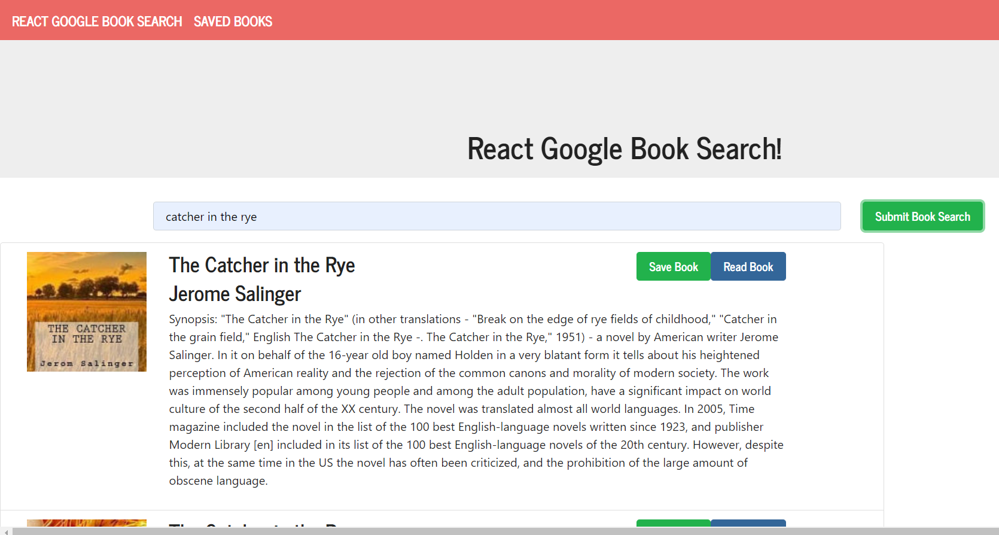

# GoogleBooks Search #
**[Deployed Heroku Link](https://guarded-brushlands-40382.herokuapp.com/)**

Search googlebooks api and save books into your own private collection

## Table of contents
* [General info](#general-info)
* [Technologies](#technologies)
* [Setup](#setup)
* [Screenshots](#screenshots)

# General info #

- This web app takes a search query from the user and hits the googlebooks api returning the results displayed on page using `ReactJS` State, this updates a component without having to reload entire page. 
- When a user hits a save button which is dynamically generated with each book, an ID is of book is taken and filtered through the results array. With the book information gathered into an object an API call is made using `Axios` which is sent to `MongoDB` creating an entry in the users book database.  
- When user goes to their saved books they have the option to delete the book from their collection which removes the item from the database.

# Technologies #
Project is created with:
* `ReactJS` 
* `Axios` version 0.18.0
* `Express` version 4.16.3
* `Mongoose` version 5.3.16
* `NodeJS` version 8.12.0
* `MongoDB` version 8.12.0

# Setup # 

1. Start by installing front and backend dependencies from package.json. While in top level, run the following command:
```
npm install
```
This should install node modules within the server and the client folder.

2. After both installations complete and Mongo, run the following command in your terminal:
```
npm start
```
- Runs the app in the development mode.<br>
Open [http://localhost:3000](http://localhost:3000) to view it in the browser.

The page will reload if you make edits.<br>
You will also see any lint errors in the console.

# Screenshots #

